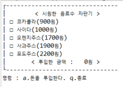
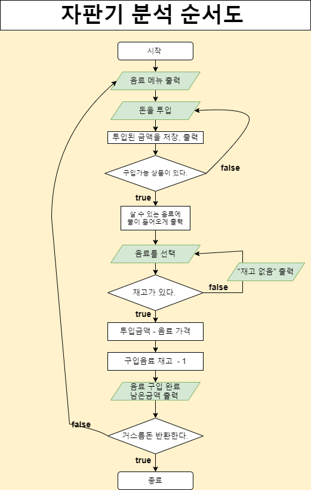

# JavaVendingMachine

#### 0. 작동

#### 1. [2021-09-25] 순서도 작성 
코드를 작성하기전에 논리를 구성해보는 것도 도움이 된다. 
- [Flow Chart](#3-flow-chart) 
#### 2. [2021-09-26] 콘솔창으로 구현
- 돈 투입시 자판기의 투입 금액 표시 기능 
- 투입금액에 따라 주문가능한 음료 표시 기능
- 재고가 없으면 음료 구매 할 수 없음
- 종료시 남은 돈 출력 후 종료. 

#### 3. Flow chart

### Flow Chart
